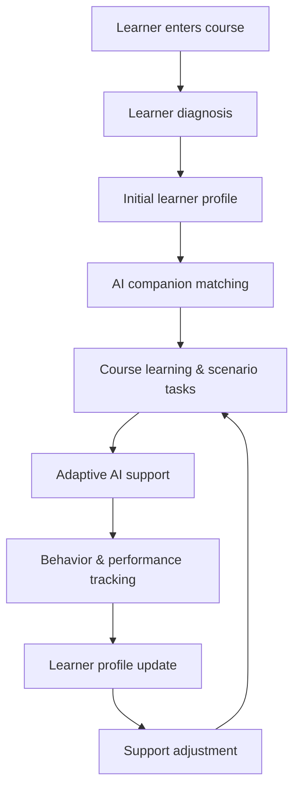

# 知伴学境

### AI-Supported Online Learning Platform

**知伴学境** is an AI-supported online learning platform that provides personalized learning support based on each learner's current needs.

The platform builds an initial learner profile, matches the learner with an appropriate AI companion, supports course learning and scenario-based tasks, tracks learning behavior and task performance, and continuously updates future support.


## Live Demo

**Netlify:**  
https://zhibanxuejing-online-learning.netlify.app/


## Overview

Online learners may face different difficulties during the same course:

- difficulty understanding abstract concepts;
- difficulty starting or managing complex tasks;
- difficulty applying knowledge to real-world problems;
- difficulty organizing ideas and participating in discussion.

知伴学境 uses learner profiling, AI companion matching, scenario-based learning, collaboration, and continuous feedback to provide targeted support throughout the learning process.

The core product loop is:

```text
Understand
   ↓
Match
   ↓
Support
   ↓
Observe
   ↓
Adapt
   ↺
```

## How It Works



The learner profile changes with the learner's progress and current support needs.

## Key Features

### 1. Learner Profiling

Learners complete a lightweight diagnostic activity before beginning the course.

The platform builds an initial profile across five dimensions:

- learning motivation triggers;
- learning support preferences;
- self-regulation and emotional management;
- perceived learning difficulties;
- cognitive processing preferences.

The learner can review the result, understand the recommendation, and adjust the profile if needed.

### 2. Adaptive AI Learning Companions

The platform includes four AI learning companions:

| AI Companion | Primary Support |
| --- | --- |
| **Concept Understanding Companion** | Concept explanation, examples, misconceptions, knowledge structure |
| **Task Planning Companion** | Task decomposition, progress planning, reminders |
| **Scenario Application Companion** | Case analysis, knowledge transfer, role-based problem solving |
| **Collaborative Discussion Companion** | Idea organization, discussion preparation, reflective questioning |

The system uses a **primary companion + auxiliary support** model.

Learners can receive support from different companions as their needs change across learning activities.

### 3. Chapter-Based Learning Environment

Course content is organized by chapter and integrated into one learning workspace.

Learning resources may include:

- PPT/PDF materials;
- textbook readings;
- extended resources;
- chapter discussions;
- knowledge Q&A.

AI support is embedded into relevant learning activities and pages.

### 4. RAG-Style Knowledge Q&A

Each chapter has a dedicated knowledge Q&A area. The AI response is constrained by the selected chapter and the corresponding resource index. If the available course materials are insufficient, the system is designed to state that limitation instead of fabricating content.

### 5. Scenario-Based Learning

Learners apply course knowledge to real-world educational problems.

Example scenarios include:

- designing a digital training program for county-level teachers;
- redesigning a low-completion MOOC into a MOOC + SPOC model;
- designing emergency online learning during school closures;
- improving a rural dual-teacher classroom model.

Scenario tasks require learners to analyze problems, apply course concepts, consider multiple stakeholder perspectives, and design practical solutions.

AI provides prompts, examples, planning support, and reflection scaffolds during the task process.

### 6. Collaborative Task Workspace

Scenario tasks can be completed collaboratively.

The prototype includes:

- group discussion;
- shared task writing;
- role-based problem analysis;
- contribution indicators;
- peer interaction;
- AI-supported discussion;
- AI teacher intervention prototypes.

The collaboration design supports explanation, evidence use, negotiation, and collaborative problem solving.

### 7. Continuous Feedback and Adaptive Support

The platform tracks learning process data such as:

- resource usage;
- quiz performance;
- task initiation and progress;
- task revisions;
- discussion participation;
- collaboration behavior;
- AI interaction.

These signals update the learner profile and future support strategy.

```text
Learning data
    ↓
Profile update
    ↓
Support adjustment
    ↓
Learner confirmation
    ↓
Next learning cycle
```

## Product Principles

### Learner First

Learners complete the core thinking, judgment, expression, and task decisions.

AI provides explanation, prompts, questions, planning support, examples, organization support, and feedback.

### Dynamic Learner Profile

The learner profile represents the learner's current state and support needs.

It can change with new learning behavior, task performance, collaboration, and learner feedback.

### Explainable Support

The platform explains:

- what support is recommended;
- why it is recommended;
- what learning evidence contributed to the recommendation.

### Contextual AI Support

Different learning activities trigger different support:

```text
Concept learning
→ Concept support

Task preparation
→ Planning support

Real-world problem solving
→ Scenario application support

Discussion
→ Collaborative discussion support
```

### Learner Control

Learners can:

- review profile results;
- adjust or retake the diagnostic;
- accept or postpone support;
- request more or less AI assistance.

## Tech Stack

- **Frontend:** HTML, CSS, Vanilla JavaScript
- **Local backend:** Node.js native HTTP server
- **AI model:** DeepSeek Chat Completions API
- **Serverless backend:** Netlify Functions
- **Deployment:** Netlify
- **Structured data:** JSON, CSV
- **Client-side persistence:** localStorage
- **Learning resources:** PPT, PDF
- **Documentation:** Markdown

## Project Structure

```text
.
├── index.html
├── package.json
├── netlify.toml
│
├── src/
│   ├── app.js
│   └── styles.css
│
├── scripts/
│   └── serve.mjs
│
├── netlify/
│   └── functions/
│       ├── agent-chat.js
│       ├── deepseek.js
│       ├── section-chat.js
│       └── lib/
│           └── deepseek-common.js
│
├── data/
│   ├── knowledge/
│   │   └── knowledge-base.md
│   ├── mappings/
│   │   ├── knowledge-level-mapping.csv
│   │   └── knowledge-trigger-priority.csv
│   ├── rag/
│   │   ├── resourceIndex.json
│   │   └── resourceIndex.example.json
│   └── scenarios/
│       └── scenarios.json
│
├── docs/
│   └── product/
│       ├── product-overview.md
│       └── feature-requirements.md
│
├── resources/
│   └── teaching/
│       ├── lesson-materials/
│       ├── examples/
│       └── references/
│
└── public/
    └── images/
```

### Directory Responsibilities

- `src/` — frontend application code
- `netlify/functions/` — serverless AI API endpoints
- `data/` — structured data used by the application and AI generation pipeline
- `resources/` — source course materials and learning assets
- `docs/` — product and feature documentation
- `public/` — static frontend assets

## Product Documentation

- [Product Overview](docs/product/product-overview.md)
- [Feature Requirements](docs/product/feature-requirements.md)

## Local Development

Clone the repository:

```bash
git clone https://github.com/tongshuy/online-learning-platform.git
cd online-learning-platform
```

Install dependencies:

```bash
npm install
```

Start the local server:

```bash
npm run start
```

Default local address:

```text
http://localhost:5174
```

To use a different port:

```bash
PORT=5176 node scripts/serve.mjs
```

## AI Configuration

AI requests are routed through the local backend or Netlify Functions so the API key stays on the server side.

Create a local environment file based on `.env.example`:

```text
DEEPSEEK_API_KEY=your_deepseek_api_key
DEEPSEEK_MODEL=deepseek-chat
```

Restart the local server after updating environment variables.

For Netlify deployment, configure the same variables in:

```text
Netlify Site configuration
→ Environment variables
```

Required variables:

```text
DEEPSEEK_API_KEY
DEEPSEEK_MODEL
```

## Deployment

The project is deployed as a static frontend with Netlify Functions.

API routes are mapped through `netlify.toml`:

```text
/api/deepseek
→ /.netlify/functions/deepseek

/api/agent-chat
→ /.netlify/functions/agent-chat

/api/section-chat
→ /.netlify/functions/section-chat
```

## Security

- Never commit `.env.local`.
- Never expose API keys in frontend JavaScript.
- Route external AI requests through server-side or serverless functions.
- Rotate any key that may have been exposed.

## Current Status

This project is a **functional product prototype**.

The current version demonstrates the complete flow from learner diagnosis and AI companion matching to scenario-based learning, collaborative tasks, and feedback-driven profile updates.

Some analytics and collaboration behaviors are currently simulated or stored through `localStorage`.

Future development may include:

- persistent user authentication;
- database-backed learner profiles;
- production collaboration infrastructure;
- semantic/vector retrieval for course resources;
- more robust learning analytics;
- teacher-facing analytics dashboards.

## Author

**Yang Tongshu**
