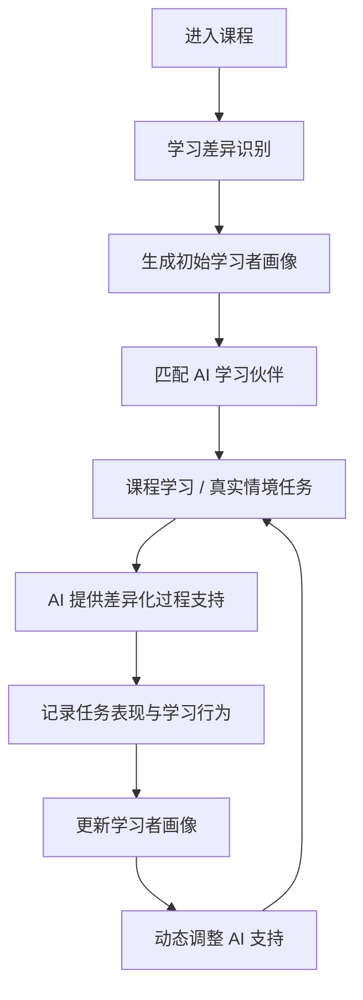

# Product Overview

# 知伴学境

**AI 支持型在线学习平台**

> 让 AI 不只是回答问题，而是在理解学习者的基础上，提供真正适合当前学习状态的支持。

---

## 1. 产品是什么

**知伴学境**是一款面向在线课程学习场景的 AI 支持型学习平台。

平台不把所有学习者放在同一条学习路径上，而是先了解学习者当前的学习特点和支持需求，再为其匹配合适的 AI 学习伙伴。学习过程中，AI 会结合课程学习、真实情境任务、协作讨论和学习行为持续提供支持，并根据新的学习表现动态调整后续支持方式。

当前产品以《在线教育原理》课程为主要应用场景，将课程资源学习、AI 学伴、真实情境任务、协作互动和学习诊断整合在同一个学习空间中。

产品的核心不是“增加一个 AI 聊天框”，而是建立一套持续运行的个性化支持机制：

**识别学习者差异 → 匹配合适支持 → 在真实任务中观察表现 → 根据表现持续调整支持。**

---

## 2. 为什么要做

现有在线学习平台已经可以提供视频、课件、测验、讨论区和作业提交等功能，但“资源齐全”并不意味着每个学习者都能获得合适的学习支持。

在实际学习过程中，不同学习者遇到的问题并不相同：

- 有人看完课程资源后仍然抓不住核心概念；
- 有人知道任务要求，却不知道应该从哪里开始；
- 有人理解了知识，但不会把知识应用到真实问题中；
- 有人有自己的想法，却不习惯在讨论中表达；
- 有人学习初期需要大量提醒，但随着学习推进逐渐能够自主完成任务。

如果平台只提供统一资源、统一提醒和统一反馈，就很难回应这些差异。

生成式 AI 虽然能够解释概念、回答问题和生成内容，但如果 AI 只是随时回答用户提出的问题，或者直接给出完整答案，它仍然没有解决两个关键问题：

1. **AI 不知道当前学习者真正需要什么支持；**
2. **AI 的支持可能替代学习者思考，而不是帮助学习者形成能力。**

因此，知伴学境希望解决的不是“如何让 AI 回答更多问题”，而是：

> **如何让平台先理解学习者，再让 AI 在合适的时间、以合适的方式提供支持。**

---

## 3. 目标用户

### Primary User

当前产品主要面向正在参与在线课程学习的学习者，现阶段以《在线教育原理》课程中的远程学习者为核心使用对象。

这类学习者需要独立完成大量课程资源学习、任务推进和线上互动，因此可能在以下方面产生不同程度的支持需求：

- 概念理解；
- 学习规划与任务推进；
- 知识迁移与实际应用；
- 讨论表达与协作参与。

### Secondary User

教师是平台中的辅助使用者。

教师可以通过学习过程数据和阶段性诊断了解班级整体学习状态及个体支持需求，但平台的主要交互体验仍然围绕学习者展开。

---

## 4. 核心问题

知伴学境重点解决四个连续发生的问题。

### 4.1 平台不了解“这个学习者现在需要什么”

传统平台往往根据课程进度向所有学习者提供相同内容。

知伴学境首先通过轻量化的 AI 学伴匹配测试建立初始学习画像，并在后续学习过程中继续根据行为和任务表现更新画像。

---

### 4.2 AI 支持与学习者真实需求不匹配

一个需要理解抽象概念的学习者，与一个容易拖延的学习者，需要的 AI 支持完全不同。

因此平台不是提供一个统一 AI 助手，而是根据当前主要需求匹配不同类型的 AI 学习伙伴。

---

### 4.3 学习容易停留在“看资源、记概念、交作业”

课程学习不仅需要理解知识，还需要把知识用于真实问题。

平台因此将知识点放入真实情境任务中，让学习者经历：

**理解问题 → 调用知识 → 表达观点 → 与同伴协作 → 形成方案 → 修改完善**

AI 在这一过程中提供支架，但不直接替学习者完成任务。

---

### 4.4 一次测评无法代表学习者整个学习过程

学习者的状态会变化。

一个最开始需要任务规划支持的学习者，之后可能已经能够稳定推进任务；一个开始阶段概念掌握较好的学习者，也可能在真实任务中暴露出知识迁移困难。

因此，学习画像不是固定标签。

平台持续记录学习行为、任务过程、讨论互动和 AI 使用情况，将新的表现重新反馈到学习画像中，并调整后续支持。

---

## 5. 产品价值主张

知伴学境希望把在线学习中的 AI 从一个**被动回答问题的工具**，转变为一个**能够理解学习状态并持续提供学习支架的伙伴**。

平台提供的核心价值包括：

### Understand

**先理解学习者，再提供支持。**

通过初始匹配测试和持续过程数据识别学习者当前状态，而不是假设所有学习者拥有相同需求。

### Match

**不同问题，匹配不同支持。**

根据学习者当前主要需求匹配 AI 学伴，同时允许在不同学习阶段灵活调用其他支持。

### Support

**在真正需要帮助的节点出现。**

AI 不只存在于一个独立聊天页面，而是嵌入课程资源学习、任务准备、任务推进和讨论协作等具体场景。

### Practice

**让知识进入真实问题。**

通过真实情境任务和协作活动，让学习者从“知道是什么”进一步走向“知道如何使用”。

### Adapt

**支持随着学习者一起变化。**

利用新的学习行为和任务表现更新画像，使 AI 支持从一次性推荐变成持续调整。

---

## 6. 产品如何运转

平台形成一个持续循环的学习支持流程：



也可以概括为四个核心环节：

**识别差异 → 匹配支持 → 任务表现 → 反馈更新**

---

## 7. 核心体验流程

### Step 1 · 进入个人学习空间

学习者注册或登录平台，填写基本身份和学习目标，进入课程学习空间。

---

### Step 2 · 完成 AI 学伴匹配测试

正式开始学习前，学习者完成一个轻量化测试。

测试从五个方面了解学习者：

- 学习动机触发因素；
- 学习情境适应需求；
- 自我调节与情绪管理；
- 学习困难感知；
- 认知加工方式。

测试的目的不是给学习者贴标签，而是帮助平台判断：

> **当前最需要在哪个环节提供支持？**

---

### Step 3 · 生成初始学习画像

平台根据测试结果生成可视化学习画像。

学习者可以看到：

- 自己当前比较明显的学习特点；
- 可能遇到的学习困难；
- 当前主要支持需求；
- 系统推荐的 AI 学伴；
- 为什么产生这一推荐。

学习者可以确认、调整或重新测试。

---

### Step 4 · 匹配 AI 学习伙伴

平台根据学习者当前主要需求推荐一个主 AI 学伴，同时允许调用其他辅助学伴。

| AI 学习伙伴 | 主要解决的问题 | 典型支持 |
| --- | --- | --- |
| 概念理解伙伴 | 看了很多内容仍抓不住重点 | 概念解释、知识结构、例子、易错点 |
| 任务规划伙伴 | 不知道从哪里开始、容易拖延 | 任务拆解、计划安排、阶段提醒 |
| 情境应用伙伴 | 理解知识但不会实际应用 | 案例分析、角色视角、迁移提示 |
| 共同讨论伙伴 | 不敢表达或观点缺少结构 | 表达陪练、观点整理、追问、讨论支持 |

平台采用 **“主学伴 + 辅助调用”** 的方式，而不是把学习者永久固定在某一种类型中。

---

### Step 5 · 进入课程学习

学习者在课程页面完成视频、PPT、教材、测验和章节讨论等常规学习活动。

AI 学伴与课程页面结合，在学习者真正出现困难时提供支持。

例如：

- 多次回看某个知识点时，概念理解伙伴可以主动提供解释；
- 长时间没有开始任务时，任务规划伙伴可以帮助拆解第一步；
- 准备进入真实任务时，可以先复习任务涉及的关键概念；
- 准备发布讨论观点前，可以先与共同讨论伙伴进行表达练习。

---

### Step 6 · 进入真实情境任务

完成基础资源学习后，学习者需要把课程知识用于具体问题。

当前任务场景包括：

- 县域教师数字化培训项目设计；
- 高校 MOOC 完成率低的课程改造；
- 乡村学校双师课堂与资源公平。

任务页面提供：

- 问题背景；
- 核心任务；
- 相关知识点；
- 待解决问题；
- 多角色视角；
- 任务步骤；
- 小组协作空间。

学习者需要自己完成问题分析、方案设计和协作讨论。

---

### Step 7 · AI 提供过程支持

AI 不直接替学习者完成任务，而是在不同节点提供适度支架。

例如：

- **概念理解伙伴**：帮助理解任务涉及的关键知识；
- **任务规划伙伴**：帮助拆解复杂任务和管理进度；
- **情境应用伙伴**：提供案例线索、角色视角和问题分析框架；
- **共同讨论伙伴**：帮助准备表达、提出追问并整理讨论共识。

产品设计遵循：

> **Learner first, AI second.**

即学习者先思考和表达，AI 再根据需要提供支持。

---

### Step 8 · 记录真实学习表现

平台不只记录最终成绩，还记录学习过程中能够反映真实状态的信息，包括：

- 课程资源使用；
- 测验表现；
- 任务启动与推进；
- 任务成果与修改过程；
- 讨论表达与同伴回应；
- 小组协作；
- AI 学伴使用情况。

这些数据用于回答一个问题：

> **学习者现在的状态，和课程开始时相比发生了什么变化？**

---

### Step 9 · 更新学习画像

平台根据新的学习行为和任务表现重新判断学习者当前状态。

例如：

- 原本容易拖延，但近期能够持续提前完成阶段任务；
- 概念理解没有明显问题，但真实任务中的知识迁移较弱；
- 任务质量很好，但很少参与同伴讨论；
- 讨论积极，但观点缺少结构和证据。

这些新的表现会进入学习画像，而不是被初始测试结果覆盖。

---

### Step 10 · 动态调整支持

画像更新后，平台同步调整下一阶段的支持。

例如：

```text
原状态
任务规划支持需求较高
        ↓
持续按时完成阶段任务
        ↓
降低任务提醒强度
```

或：

```text
原状态
概念理解情况较好
        ↓
真实任务中知识迁移困难
        ↓
增加情境应用伙伴支持
```

由此形成：

**学习 → 表现 → 识别 → 调整 → 再学习**

的持续循环。

---

## 8. 产品设计原则

### 8.1 个性化不是“贴标签”

学习画像描述的是学习者**当前状态**，而不是固定的人格分类。

系统允许画像随着学习过程变化，也允许学习者确认、修改和反馈系统判断。

---

### 8.2 AI 提供支架，而不是代替学习

AI 可以：

- 解释；
- 提示；
- 拆解；
- 提问；
- 提供案例；
- 帮助整理观点；
- 提供反馈。

但最终的：

- 思考；
- 判断；
- 表达；
- 方案设计；
- 小组决策；

仍然由学习者完成。

---

### 8.3 AI 应该进入学习流程，而不是独立存在

产品不把 AI 设计成课程旁边的一个通用聊天机器人。

不同 AI 支持应出现在真正相关的场景中：

```text
课程知识学习
→ 概念理解支持

任务开始与推进
→ 任务规划支持

真实问题解决
→ 情境应用支持

讨论与协作
→ 共同讨论支持
```

---

### 8.4 反馈必须告诉用户“下一步做什么”

平台的反馈目标不是只生成分数或标签，而是帮助学习者理解：

- 我现在做得怎么样？
- 哪个环节可能存在困难？
- 为什么系统这样判断？
- 下一步我可以怎么做？
- AI 支持为什么发生变化？

---

### 8.5 学习者拥有最终控制权

AI 推荐和学习画像都需要保持可解释。

学习者可以：

- 查看系统判断依据；
- 确认或调整画像；
- 重新测试；
- 接受或暂缓某类支持；
- 表达希望增加或减少某类 AI 支持。

---

## 9. 产品核心闭环

知伴学境最终形成的是一个持续的个性化学习闭环：

```text
Understand
理解学习者
     ↓
Match
匹配支持
     ↓
Learn & Practice
学习与真实任务实践
     ↓
Observe
观察学习表现
     ↓
Adapt
更新画像与支持
     ↺
```

平台真正希望实现的不是：

> **“每个学生都有一个 AI。”**

而是：

> **“每个学生都能在当前最需要帮助的地方，获得适度、可解释、不会替代自主思考的 AI 支持。”**

---

## 10. 当前产品范围

当前版本围绕《在线教育原理》课程构建完整学习体验，主要包括：

- 个人学习空间；
- AI 学伴匹配测试；
- 五维学习画像；
- 四类 AI 学习伙伴；
- 课程资源学习；
- 章节讨论；
- 真实情境任务；
- 小组协作与多角色问题解决；
- 学习过程记录；
- 阶段性学习诊断；
- 学习画像动态更新；
- AI 支持策略调整。

更加详细的功能、触发条件和交互要求见：

[`feature-requirements.md`](./feature-requirements.md)
